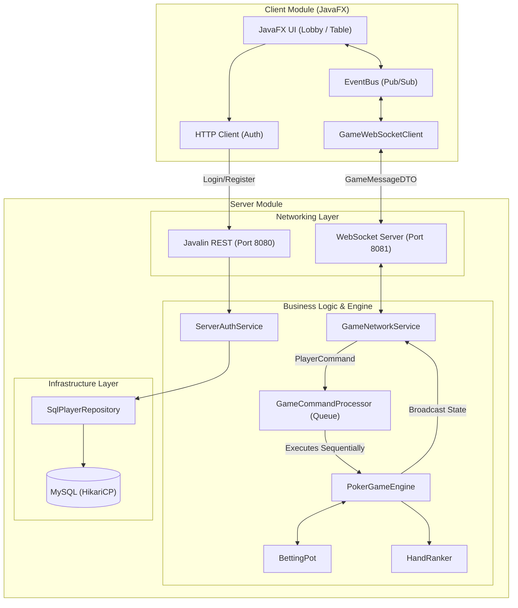
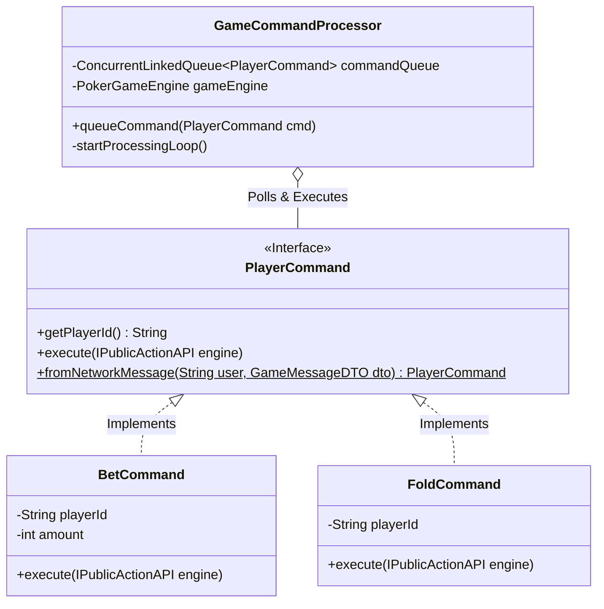
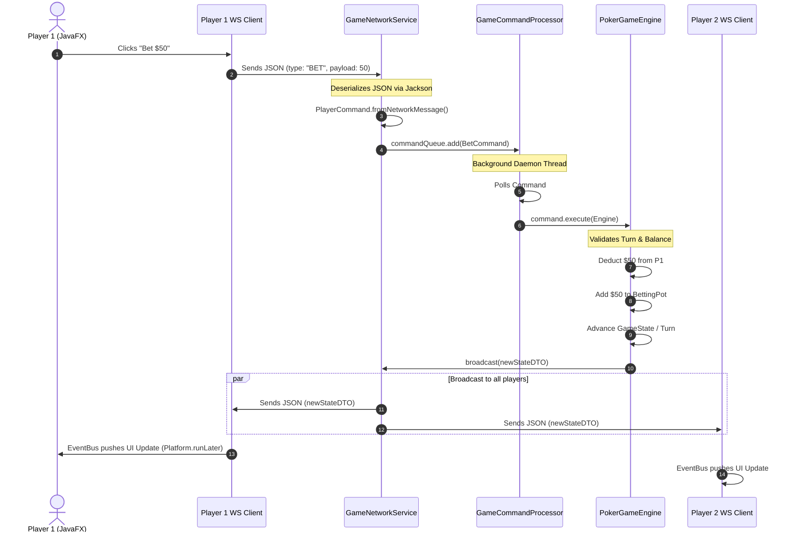

# Architecture & Technical Documentation: Multiplayer Poker Engine

> Production-grade multiplayer Texas Hold'em poker engine built with Java, WebSockets, concurrency-safe command processing, and modular server/client architecture.

---

# Table of Contents

* [Project Overview](#project-overview)
* [Core Technical Goals](#core-technical-goals)
* [Architecture Style](#architecture-style)
* [High-Level Architecture](#high-level-architecture)
* [Core Architectural Decisions](#core-architectural-decisions)
* [Module Documentation](#module-documentation)
* [Core Class Documentation](#core-class-documentation)
* [Game Flow](#game-flow)
* [Concurrency & Multiplayer Design](#concurrency--multiplayer-design)
* [State Management](#state-management)
* [Error Prevention & Edge Cases](#error-prevention--edge-cases)
* [Design Patterns Used](#design-patterns-used)
* [Future Improvements](#future-improvements)
* [Testing Strategy](#testing-strategy)

---

### Prerequisites
* **Java 21** (or higher)
* **Maven 3.8+**
* **MySQL 8.0+** (Running locally or via Docker)

### Build and Run Instructions

1. **Clone the repository & build the project:**
   ```bash
   git clone https://github.com/drenisb-uni/PokerGame.git
   cd poker-engine
   mvn clean install
   ```

2. **Configure Database:**
   Update the `application.properties` in the `poker-server` module to point to your local MySQL instance. The `HikariCP` pool will handle connection initialization.

3. **Start the Server:**
   ```bash
   cd poker-server
   mvn exec:java -Dexec.mainClass="pokergame.server.ServerApp"
   ```

4. **Launch the Client(s):**
   Open a new terminal to start a human player client instance:
   ```bash
   cd poker-client
   mvn javafx:run -DmainClass="pokergame.client.Launcher"
   ```
   *(Note: You can run this command in multiple terminal windows to simulate multiple players at the same table).*

### Project Structure
```text
poker-engine/
├── poker-common/    # Immutable DTOs and shared network language (GameMessageDTO)
├── poker-client/    # JavaFX UI, WebSocket Client, EventBus Pub/Sub
└── poker-server/    # Core Game Engine, Command Queue, Javalin/WebSocket backend
```

---

# Project Overview

## Purpose of the System

The Poker Game project is a production-grade, distributed multiplayer poker application designed to support real-time, highly concurrent gameplay between globally distributed human players and locally hosted AI bots.

The project focuses heavily on:

* server authority
* thread safety
* modularity
* scalability
* network decoupling
* deterministic game execution

---

## Type of Poker Game Implemented

### Texas Hold'em

Supporting:

* Pre-Flop
* Flop
* Turn
* River
* Showdown

---

# Core Technical Goals

## 1. Absolute Thread Safety

Prevent race conditions in high-concurrency environments where multiple clients may attempt actions simultaneously.

---

## 2. Strict Client-Server Authority

The server maintains total control over:

* game state
* deck generation
* betting validation
* turn order
* rule enforcement

This prevents:

* cheating
* memory inspection
* packet manipulation exploits

---

## 3. Decoupled Architecture

Strict separation between:

* networking infrastructure
* database infrastructure
* UI rendering
* business logic
* game engine logic

---

## 4. UI / Network Isolation

JavaFX UI components are fully isolated from:

* WebSocket threads
* background engine threads
* asynchronous networking events

---

# Architecture Style

The system uses a:

* Modular Architecture
* Layered Architecture
* Event-Driven Architecture
* Command Pattern
* Observer / Publish-Subscribe Pattern

---

# High-Level Architecture

The application is divided into three primary modules:

```text
poker-common
poker-client
poker-server
```
The architecture is strictly separated to ensure that UI rendering code never touches networking code, and networking code never directly mutates the state of the poker game.



---

## Architectural Layers

### Networking Layer (Javalin + WebSockets)

* Port `8080`

  * HTTP REST API
  * authentication
  * registration

* Port `8081`

  * dedicated WebSocket server
  * low-latency bidirectional poker communication

---

### Infrastructure Layer

Responsible for:

* HikariCP connection pooling
* database lifecycle management
* dependency initialization

---

### Repository Layer

Responsible for:

* SQL abstraction
* player persistence
* profile retrieval
* password verification

Key interfaces/classes:

* `IPlayerRepository`
* `SqlPlayerRepository`

---

### Command Processing Layer

Responsible for:

* asynchronous command queuing
* sequential execution
* synchronization guarantees

Key component:

* `GameCommandProcessor`

---

To safely transition asynchronous network strings into thread-safe game operations, the architecture relies heavily on the **Command Pattern**. This completely decouples the WebSocket network layer from the `PokerGameEngine`.

### Architecture Visualized


### Engine Layer

The heart of the application.

Responsible for:

* game state transitions
* betting rounds
* showdown logic
* turn traversal
* pot distribution

Key component:

* `PokerGameEngine`

---

### Domain Layer

Contains:

* immutable DTOs
* domain models
* enums
* interfaces
* poker rules

---

# Data Flow

```text
Client Action
    ↓
GameMessageDTO
    ↓
WebSocket Server
    ↓
PlayerCommand Factory
    ↓
GameCommandProcessor Queue
    ↓
PokerGameEngine
    ↓
BettingPot / TableManager / HandRanker
    ↓
GameEventBroadcaster
    ↓
WebSocket Clients
    ↓
JavaFX EventBus
    ↓
UI Rendering
```
To support massive multiplayer concurrency without state corruption or financial anomalies, the system strictly relies on **Thread Confinement and Sequential Queuing**. The diagram below demonstrates how a concurrent action is safely processed.



---
---

# Core Architectural Decisions

## Envelope Pattern (`GameMessageDTO`)

### Why

WebSockets provide a single communication pipe.

A standardized DTO envelope containing:

* type
* sender
* payload

allows generic deserialization before routing.

---

## Dual-Port Networking Strategy

### Why

Separating:

* REST traffic
* persistent game traffic

prevents heavy authentication/database requests from interfering with real-time gameplay latency.

---

## Command Pattern (`PlayerCommand`)

### Why

Encapsulating actions as objects:

* centralizes validation
* improves extensibility
* prevents malformed payload execution

Examples:

* `BetCommand`
* `FoldCommand`
* `CallCommand`

---

## Sequential Queue Processing (`GameCommandProcessor`)

### Why

WebSocket events are asynchronous.

Direct game-state mutation from multiple threads creates:

* race conditions
* inconsistent pots
* broken turn order

Using a single-threaded command processor guarantees deterministic execution.

---

## EventBus UI Decoupling

### Why

Prevents:

* tangled controller logic
* JavaFX threading violations
* direct network/UI coupling

All UI updates safely execute via:

```java
Platform.runLater()
```

---

## Polymorphic Participants (`TableParticipant`)

### Why

The engine should not care whether participants are:

* humans
* AI bots

This abstraction enables:

* AI integration
* network transparency
* cheat prevention

---

# Module Documentation

# `poker-common`

## Purpose

Shared communication layer between client and server.

## Responsibilities

Defines immutable DTOs:

* `GameMessageDTO`
* `PlayerProfileDTO`
* `LoginRequestDTO`

---

# `poker-client`

## Purpose

Frontend application for players.

## Responsibilities

* UI rendering
* session management
* network lifecycle management
* event handling

## Major Components

* `Launcher`
* `LobbyController`
* `GameTableController`
* `GameWebSocketClient`
* `EventBus`
* `SessionManager`

---

# `poker-server`

## Purpose

Authoritative multiplayer poker server.

## Responsibilities

* authentication
* game orchestration
* rule enforcement
* persistence
* networking

---

## Packages

### `dbinfrastructure`

Database access and HikariCP setup.

### `domain.repository`

Repository abstractions.

### `engine`

Core poker logic.

### `network`

WebSocket listeners.

### `service`

Business orchestration services.

---

# Core Class Documentation

# `PokerGameEngine`

## Purpose

Master orchestrator for the poker lifecycle.

## Responsibilities

* hand initialization
* betting progression
* showdown handling
* state transitions
* winner determination

---

# `TableManager`

## Purpose

Manages:

* seats
* dealer button
* active players
* turn traversal

---

# `BettingPot`

## Purpose

Financial accounting engine.

## Responsibilities

* pot tracking
* blinds
* calls
* raises
* folds
* betting round resets

---

# `GameCommandProcessor`

## Purpose

Concurrency synchronization engine.

## Major Fields

```java
ConcurrentLinkedQueue<PlayerCommand>
Thread processorThread
```

## Responsibilities

* queue polling
* sequential command execution
* multiplayer synchronization

---

# `HandRanker`

## Purpose

Evaluates poker hands independently from engine state.

## Responsibilities

* hand comparison
* tie-breaking
* ranking logic
* combinational evaluation

---

# `EventBus`

## Purpose

Client-side event distribution system.

## Responsibilities

* publish/subscribe messaging
* controller decoupling
* UI synchronization

---

# Game Flow

## 1. Player Seating

Players connect through the WebSocket server and occupy seats managed by `TableManager`.

---

## 2. Hand Initialization

`PokerGameEngine`:

* rotates dealer
* collects blinds
* initializes deck

---

## 3. Hole Card Dealing

Private cards are securely distributed to each participant.

---

## 4. Pre-Flop Betting

Game state transitions to:

```text
PRE_FLOP
```

Commands begin processing sequentially.

---

## 5. Flop / Turn / River

Community cards are revealed progressively.

Betting rounds reset after each stage.

---

## 6. Showdown

`HandRanker` evaluates all remaining players.

---

## 7. Pot Distribution

Winners receive chips from the `BettingPot`.

---

## 8. Next Hand

State resets and dealer rotates.

---

# Concurrency & Multiplayer Design

The system relies on:

* thread confinement
* sequential command execution
* asynchronous networking
* deterministic state mutation

---

## Core Principle

### Network threads NEVER mutate game state directly.

Instead:

```text
WebSocket Thread
    ↓
Queue Command
    ↓
Processor Thread
    ↓
Engine Mutation
```

This eliminates:

* race conditions
* deadlocks
* inconsistent state mutations

---

# State Management

Managed primarily through:

```java
GameState enum
```

---

## State Transitions

```text
WAITING_FOR_PLAYERS
    ↓
PRE_FLOP
    ↓
FLOP
    ↓
TURN
    ↓
RIVER
    ↓
SHOWDOWN
```

---

## Player States

Players may be:

* Active
* Folded
* All-In

Folded players are skipped automatically by traversal logic.

---

# Error Prevention & Edge Cases

## Jackson Java Time Serialization

### Problem

`LocalDateTime` parsing failures.

### Fix

Registered:

```java
JavaTimeModule
```

on all `ObjectMapper` instances.

---

## JavaFX Threading Errors

### Problem

`NotOnFXThreadException`

### Fix

All UI updates are routed through:

```java
Platform.runLater()
```

---

## Malformed Payload Injection

### Problem

Clients sending manipulated packets.

### Fix

Strict command factory validation prevents illegal payloads from reaching the engine.

---

## Betting Round Reset Bug

### Problem

Players recovering chips due to negative call calculations.

### Root Cause

`currentRoundBet` values were not reset between streets.

### Fix

Reset all player round bets during betting round transitions.

---

## Double Turn Advancement Bug

### Problem

Turn traversal executed twice per action.

### Root Cause

`advanceTurn()` called both inside commands and external executor.

### Fix

Centralized turn advancement to a single orchestration point.

---

# Design Patterns Used

| Pattern              | Purpose                         |
| -------------------- | ------------------------------- |
| Command Pattern      | Encapsulated game actions       |
| Observer Pattern     | UI event propagation            |
| Repository Pattern   | Database abstraction            |
| State Pattern        | Game phase management           |
| Factory Pattern      | Command instantiation           |
| Singleton Pattern    | Shared WebSocket client         |
| Orchestrator Pattern | Centralized engine coordination |

---

# Future Improvements

## Planned Features

* Side pots
* All-in support
* Tournament mode
* JWT reconnection handling
* Redis distributed servers
* Replay system
* Spectator mode
* AI difficulty scaling
* Distributed table balancing

---

# Testing Strategy

## Engine Simulation Tests

JUnit-based deterministic engine simulations validate:

* betting logic
* state transitions
* pot consistency

---

## HandRanker Tests

Edge-case validation for:

* straights
* flushes
* full houses
* tie-breakers

---

## Mock Repository Tests

Repository mocking enables:

* isolated authentication testing
* database-independent validation

---

# Technology Stack

## Backend

* Java
* Javalin
* Jetty WebSockets
* Jackson
* HikariCP
* MySQL

## Frontend

* JavaFX

## Testing

* JUnit 5
* Mockito

---

# Key Architectural Strengths

✅ Deterministic Multiplayer Execution
✅ Strict Thread Safety
✅ Server Authoritative Design
✅ Fully Decoupled Architecture
✅ Production-Oriented Networking Design
✅ Extensible Poker Engine
✅ AI-Compatible Player Model
✅ UI / Engine Isolation

---
