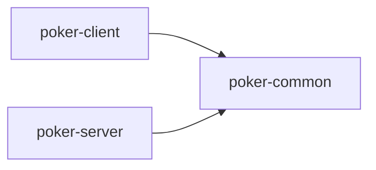
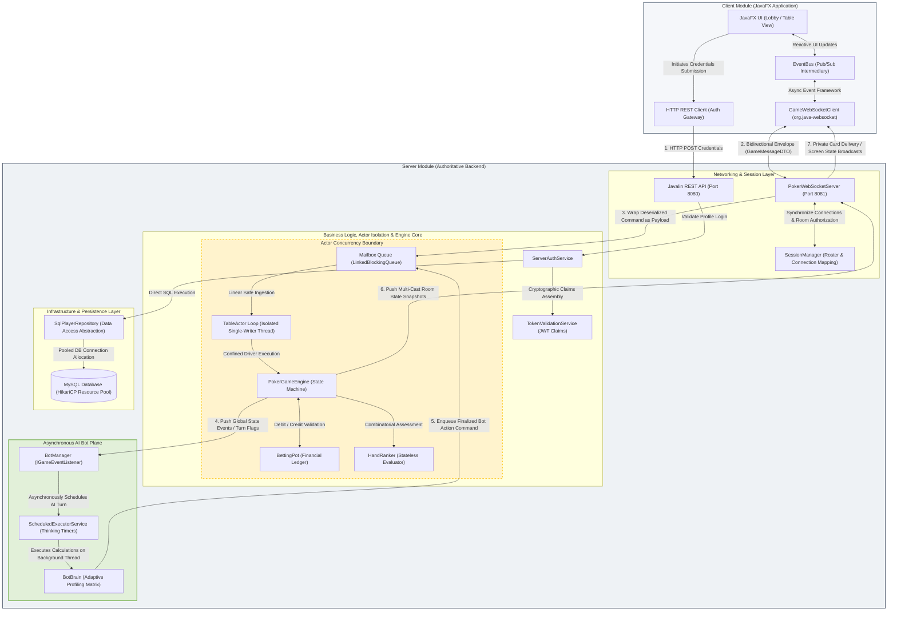

# Architecture & Technical Documentation: Multiplayer Poker Engine

## Table of Contents

* [Build and Run Instructions](#build-and-run-instructions)
* [Project Structure](#project-structure)
* [Module Structure](#module-structure)
* [1. Project Overview](#1-project-overview)
* [2. High-Level Architecture](#2-high-level-architecture)
* [3. Core Architectural Decisions](#3-core-architectural-decisions)
* [4. Module Documentation](#4-module-documentation)
* [5. Core Class Documentation](#5-core-class-documentation)
* [6. Game Flow Documentation](#6-game-flow-documentation)
* [7. Concurrency & Multiplayer Design](#7-concurrency--multiplayer-design)
* [8. State Management](#8-state-management)
* [9. Error Prevention & Edge Cases](#9-error-prevention--edge-cases)
* [10. Design Patterns Used](#10-design-patterns-used)
* [11. Future Improvements](#11-future-improvements)
* [12. Testing Strategy](#12-testing-strategy)
---

### Prerequisites

* **Java 21** (or higher)
* **Maven 3.8+**
* **MySQL 8.0+** (Running locally or via Docker)

---

## Build and Run Instructions

1. **Clone the repository & build the project:**
```bash
git clone https://github.com/drenisb-uni/PokerGame.git
cd poker-engine
mvn clean install

```


2. **Configure Database:**
Update the `application.properties` file located within the resources directory of the `poker-server` module to point to your active MySQL instance. The connection parameters will be picked up by the `HikariCP` pool provider to establish safe, concurrent connection channels.
3. **Start the Server:**
```bash
cd poker-server
mvn exec:java -Dexec.mainClass="pokergame.server.ServerApp"

```


4. **Launch the Client(s):**
Open a new distinct terminal window to spawn a human player client interface instance:
```bash
cd poker-client
mvn javafx:run -DmainClass="pokergame.client.Launcher"

```


*(Note: You can execute this launch command across multiple isolated terminal windows to simulate multiple human players interacting simultaneously at the exact same virtual poker table).*

---

## Project Structure

```text
poker-engine/
├── poker-common/    # Immutable DTOs and shared network language (GameMessageDTO)
├── poker-client/    # JavaFX UI, WebSocket Client, EventBus Pub/Sub abstraction layer
└── poker-server/    # Core Game Engine, TableActor Mailbox System, BotManager, Javalin/WebSocket backend

```

---

## Module Structure



---

## 1. Project Overview

**Purpose of the System**
The Poker Game project is a production-grade, distributed multiplayer poker application. It is designed to facilitate real-time, highly concurrent gameplay between globally distributed human players and locally hosted, algorithmic AI bots. The system mimics a real-world casino backend, prioritizing transaction integrity, state synchronization, and absolute security against client-side tampering.

**Type of Poker Game Implemented**
Texas Hold'em (No-Limit variant). The engine fully supports standard phases: Pre-Flop, Flop, Turn, River, and Showdown, including blind posting, dealer button rotation, and sequential betting rounds.

**Technology Stack**

* **Core Run-Time:** The system is built entirely utilizing the features of Java 21, leveraging features like record types for immutable data frames and virtual threads if needed. It is orchestrated using Maven for dependency management and cross-module compilation (poker-common, poker-client, poker-server).
* **Client User Interface:** The desktop application utilizes JavaFX for its event-driven graphical user interface, decoupling rendering architectures from reactive network processing channels.
* **Web Routing & Stateless Auth (HTTP):** On the backend, Javalin handles the lightweight HTTP/REST routing strictly for stateless player authentication, profile registration, and initial verification.
* **Real-Time Bidirectional Networking:** Low-latency game packet transmissions are powered by dedicated native WebSockets via `org.java-websocket`.
* **Data Serialization Pipeline:** Strict JSON serialization and deserialization across the network wire are handled by Jackson, explicitly configured with the JavaTimeModule for safe timestamp transmission.
* **Database Infrastructure & Pooling:** Relational data persistence is managed via an enterprise SQL schema, with high-performance connection allocation handled via HikariCP to protect resources from thread starvation.

**Main Technical Goals**

* **Absolute Thread Safety:** Prevent race conditions in high-concurrency environments. Poker involves precise chip and financial accounting; processing two concurrent bets at the exact same millisecond must not corrupt the pot or player balances.
* **Strict Client-Server Authority:** The server acts as the single source of truth. It maintains total control over game state, deck generation, and rule enforcement. Clients only receive the data they are legally allowed to see (e.g., their own hole cards and community cards), making packet sniffing or memory inspection useless for cheating.
* **Decoupled Architecture:** Strict separation between networking infrastructure (WebSockets/HTTP), web frameworks, and core poker business logic. This ensures the game engine can be migrated to different network protocols without rewriting the poker rules.
* **UI/Network Isolation:** JavaFX UI elements are completely insulated from background networking threads, preventing application freezes and `NotOnFXThreadException` crashes.

**Overall Architecture Style**
The system utilizes a **Modular, Layered, Event-Driven Actor Model Architecture**. It implements the **Actor Pattern** for isolated game action execution (translating network packets into safe mailbox messages), the **Command Pattern** for polymorphic execution, and the **Publish/Subscribe (Observer) Pattern** for client-side state rendering.

---

## 2. High-Level Architecture

The system is compartmentalized into three distinct Maven modules to enforce strict dependency boundaries: `poker-common`, `poker-client`, and `poker-server`.

### Architectural Layers

* **Networking Layer (Javalin & WebSockets):**
* **Port 8080 (HTTP):** Manages standard HTTP REST requests. Dedicated purely to user authentication, registration, password verification, and initial profile fetching.
* **Port 8081 (WebSockets):** Hosts a dedicated WebSocket Server (`PokerWebSocketServer`) strictly for low-latency, bidirectional game traffic.


* **Session & Routing Layer (`SessionManager`):** Acts as the cryptographic and spatial gatekeeper. It holds the thread-safe `tableRoomRosters` mapping, ensuring that WebSocket frames and private snapshots are routed exclusively to authenticated occupants of specific game rooms. It maps active network connections using secure claims directly derived from the validated authentication token.
* **Infrastructure Layer:** Manages heavy system resources. Implements the `HikariDSProvider` to initialize and manage the database connection pool, preventing connection exhaustion during high concurrent logins.
* **Repository Layer (`IPlayerRepository`, `SqlPlayerRepository`):** Provides an abstraction over SQL operations. It securely fetches `PlayerProfileDTO` records and validates password hashes, shielding the domain logic from raw SQL syntax.
* **Actor & Concurrency Layer (`TableActor`):** Acts as the thread-isolation boundary. Each poker table room is encapsulated inside its own autonomous `TableActor`. Raw JSON network strings are converted into immutable `PlayerActionMessage` objects and dropped into the actor's thread-safe mailbox queue, ensuring state mutations happen purely sequentially.
* **Engine Layer (`PokerGameEngine`):** The master orchestrator. It holds the active `GameState`, manages the `BettingPot` accounting, maintains seat index state maps, and queries the `HandRanker` functional layer to determine winners.
* **Domain Layer:** Holds immutable, cross-module records (like `GameMessageDTO`) and core structural interfaces.

### Data Flow Lifecycle

1. **Action Initiation:** A user clicks "Bet $50" on the JavaFX UI.
2. **Envelope Wrapping:** The client constructs a `GameMessageDTO` envelope (type: "BET", payload: 50) and transmits it over the WebSocket connection.
3. **Gateway Reception & Validation:** The server receives the raw JSON on Port 8081. It verifies the active connection session against the `SessionManager` table room roster to prevent cross-room packet injection.
4. **Message Ingestion:** The JSON is translated into an immutable `PlayerActionMessage` and dispatched to the target room's `TableActor` mailbox (`tableActor.tell(...)`). The network thread is immediately freed.
5. **Actor Execution:** The background actor loop polls its mailbox sequentially. It passes the command to the `PokerGameEngine` to validate turn order (Is it this player's turn?) and rule legality (Does the player have enough chips?).
6. **State Mutation & Broadcast:** The Engine deducts chips, updates the `BettingPot`, determines if the betting round is over, and triggers a table snapshot broadcast. The `PokerWebSocketServer` intercepts this broadcast, queries the `SessionManager` for validated occupants, and routes the new `GameMessageDTO` envelopes down the wire.
7. **Client Rendering:** The client WebSocket receives the event, hands it to the `EventBus`, which safely triggers `Platform.runLater()` to update the UI visuals (e.g., moving chips into the center of the table).

### High-Level System Architecture


---

## 3. Core Architectural Decisions

### 1. The Envelope Pattern for WebSockets (`GameMessageDTO`)

* **What:** All WebSocket communication uses a single, standardized DTO containing type, sender, and payload fields.
* **Why:** WebSockets provide a single generic text/binary pipe. An envelope pattern allows the Jackson deserializer to uniformly parse any incoming packet, look at the type string, and route it to the correct handler.
* **Tradeoffs:** Slight overhead in message size due to repeated structural keys, but vastly improves parsing safety and system extensibility.

### 2. Dual-Port Networking Strategy

* **What:** HTTP REST runs on Port 8080; WebSockets run on Port 8081.
* **Why:** Protects the game loop. If 1,000 users attempt to log in simultaneously, the expensive Bcrypt password hashing and SQL queries on Port 8080 will not stall or block the low-latency game packets flying back and forth on Port 8081.

### 3. The Command Pattern (`PlayerCommand` / `PlayerActionMessage`)

* **What:** Translating raw string payloads into polymorphic or immutable message objects.
* **Why:** Centralizes business validation. If a malicious client sends a spoofed packet, the parsing boundary catches it, throws an `IllegalArgumentException`, and protects the core engine state from corruption.

### 4. The Actor Model Architecture (`TableActor`)

* **What:** Funneling all asynchronous network actions into a thread-safe actor mailbox queue processed by a strictly isolated event loop.
* **Why:** Eradicates race conditions. If two players attempt to act simultaneously, the network threads simply drop the commands into the actor's queue. The single actor thread processes them sequentially, guaranteeing thread-safe modifications to the pot and game state without using heavy, deadlock-prone `synchronized` blocks.

### 5. Centralized Room Topology (`SessionManager`)

* **What:** Maintaining a highly concurrent, thread-safe mapping (`Map<String, Set<String>>`) of which human usernames are authorized in which `tableId`.
* **Why:** Replaces unreliable native WebSocket connection properties. It provides a secure, single source of truth for routing. When the engine deals private hole cards, the server queries the `SessionManager` to guarantee the packet is only sent to the strictly authenticated owner of that seat.

### 6. Decoupled UI via `EventBus`

* **What:** An asynchronous Pub/Sub barrier between the network client and the JavaFX controllers.
* **Why:** WebSockets listen on a background thread. JavaFX requires all UI updates to occur on the main FX Application Thread. Direct coupling causes catastrophic `NotOnFXThreadException` crashes. The `EventBus` forces thread-safe UI handoffs.

### 7. Event-Driven AI & Bot Lifecycle (`BotManager`)

* **What:** Bots act as background listeners implementing an `IGameEventListener` interface, managed by a dedicated `ScheduledExecutorService`.
* **Why:** Decouples heavy AI calculation (`BotBrain`) from the fast human network loop. When a bot takes its turn, it computes mathematical strength and probabilities on a separate thread pool. Furthermore, the bot manager actively tracks `ScheduledFuture` objects, allowing the system to instantly abort pending bot decisions if a human leaves the table and the room tears down, preventing out-of-turn race conditions.

---

## 4. Module Documentation

### `poker-common`

* **Purpose:** The shared foundational data language bridging the client and server modules.
* **Responsibilities:** Defines strictly typed, immutable Data Transfer Objects (DTOs). By isolating these here, both client and server can depend on this module without depending on each other, preventing structural leakage.
* **Major Classes:** `GameMessageDTO` (WebSocket envelope), `PlayerProfileDTO` (User stats), `LoginRequestDTO` (Auth payload), `HandActionDTO` (Action broadcast records).

### `poker-client`

* **Purpose:** The player-facing frontend desktop application application layer.
* **Responsibilities:** JavaFX UI rendering, graphical chip and card layout animations, local session token tracking, and network lifecycle management (reconnecting on drop).
* **Major Classes:** `Launcher` (JavaFX main entry point), `LobbyController` / `GameTableController` (View UI controllers), `GameWebSocketClient` (Network engine), `EventBus` (Pub/Sub hub).

### `poker-server`

* **Purpose:** The authoritative, persistent game server backend.
* **Responsibilities:** Authentication processing, connection pooling, network routing, game rule enforcement, anti-cheat validation, and game state memory management.
* **Internal Packages:**
* `dbinfrastructure`: HikariCP database connection pool initialization and direct JDBC SQL queries.
* `domain.repository`: Abstraction interfaces for data access layer decoupling (Inversion of Control).
* `engine`: Core poker mathematics, state machines, and deck components.
* `engine.actor`: Asynchronous TableActor classes protecting thread isolation.
* `network`: Dedicated WebSocket listeners, routing algorithms, and the global `SessionManager`.
* `bot`: The `BotManager`, `BotBrain`, `BotPersonality`, and adaptive behavioral profiles.
* `service`: Decoupled business logic gateways (`TokenValidationService`, `HttpRouteService`).


---

## 5. Core Class Documentation

### `TableActor`

* **Purpose:** The concurrency synchronization and isolation chokepoint for an active poker table.
* **Major Fields:** `LinkedBlockingQueue<Object> mailbox`, `boolean running`, `Thread actorThread`.
* **Design Rationale:** Acts as an impenetrable barrier between high-velocity web traffic and the stateful engine. It ensures the `PokerGameEngine` memory is mutated by exactly one dedicated background thread, providing lock-free concurrency safety and robust lifecycle encapsulation.

### `PokerGameEngine`

* **Purpose:** The master state machine and orchestrator for the poker hand lifecycle.
* **Responsibilities:** Advances the game strictly from Pre-Flop to Showdown. It handles blind collection tracking, manages the active seat index list, requests card evaluations from the `HandRanker`, and orders the `BettingPot` to distribute chips to winners.
* **Lifecycle Role:** Lives permanently while a table instance is active. It is entirely passive; it only mutates state when driven by sequential commands passed down from the `TableActor`.

### `SessionManager`

* **Purpose:** Session, spatial, and network topology mapping.
* **Responsibilities:** Securely manages the `Map<String, Set<String>>` tableRoomRosters. It dictates exactly which web socket connections are legally authorized to receive broadcasts for any given `tableId` using secure username keys derived directly from JWT claims. It filters out virtual entities (bots) at the network broadcast boundary to eliminate false drops.

### `BotManager` & `BotBrain`

* **Purpose:** Autonomous opponent generation and asynchronous logic execution.
* **Responsibilities:** The `BotManager` listens to table events. When a bot's turn arrives, it spins up a `ScheduledFuture` task to pause for human-like thinking delay. The `BotBrain` calculates mathematical strength combined with a mapped `OpponentProfile` (tracking human fold/call frequencies) to output a highly dynamic, non-scripted `BotDecision` without blocking network pipelines. It exposes a `shutdown()` routine to wipe pending threads instantly during cleanup.

### `BettingPot`

* **Purpose:** Financial accounting and mathematical validation for the table pot.
* **Responsibilities:** Tracks sub-round bets, total aggregated pot size, and deductions from individual player chip stacks. It validates if a player has met the "to-call" threshold. It isolates the logic for wiping active round bets when community cards are dealt (e.g., transitioning from Flop to Turn).

### `HandRanker`

* **Purpose:** Pure, stateless functional evaluation of poker hands.
* **Responsibilities:** Separates the complex combinatorial logic (evaluating 7 cards to find the best 5-card Straight, Flush, or Full House) from the stateful `PokerGameEngine`. It returns a standardized score capable of breaking High-Card ties.

### `EventBus`

* **Purpose:** Client-side asynchronous message distribution hub.
* **Major Methods:** `subscribe()`, `publish()`.
* **Design Rationale:** Enforces the Observer pattern. When the network client receives cards, it blindly publishes a "DEAL_CARDS" event. The UI controller independently listens for it and animates the cards, resulting in zero hardcoded dependencies between the network and the UI.

---

## 6. Game Flow Documentation

The complete lifecycle of a single poker hand executes sequentially as follows:

```text
[JOIN TABLE] ──> [START HAND] ──> [DEAL HOLE CARDS] ──> [PRE-FLOP BETTING]
                                                               │
[SHOWDOWN] <── [RIVER BETTING] <── [TURN BETTING] <── [FLOP BETTING] <─┘
    │
[POT DISTRIBUTION] ──> [CLEANUP & RESET]

```

1. **Player Seating:** The client sends a `JOIN_TABLE` message. The WebSocket server immediately maps the connection username to the room inside `SessionManager.bindPlayerToTableRoom()`, then drops a join command into the target `TableActor` mailbox.
2. **Hand Initialization:** `PokerGameEngine` advances the Dealer button. The player to the left posts the Small Blind; the next player posts the Big Blind via the `BettingPot`.
3. **Hole Card Dealing:** The Engine instantiates a fresh 52-card deck, shuffles it, and iterates over active players. It queries the `SessionManager` roster and securely sends a private "DEAL_CARDS" `GameMessageDTO` solely to that specific client's WebSocket connection. Bots are bypassed directly to the local engine to avoid network saturation.
4. **Pre-Flop Action:** `GameState` transitions to `PRE_FLOP`. Action begins left of the Big Blind. The `TableActor` accepts bets. Turn order is strictly enforced; out-of-turn actions are immediately rejected.
5. **Flop / Turn / River Transitions:** Once betting is financially equalized (all players have matched the highest bet or folded), the engine burns a card and reveals community cards. `BettingPot` round totals are zeroed out. The Broadcaster announces the new community cards to all clients.
6. **Showdown:** Once the River round concludes, remaining players reveal their hole cards. The `HandRanker` evaluates all 7-card combinations to determine the absolute best 5-card hand per player.
7. **Pot Distribution:** The Engine awards the main pot to the winner. In the event of a tie, the pot is split evenly. Player stacks are updated in memory, and new balances are flushed to the database.
8. **Cleanup:** The Table clears community cards, resets player statuses from `FOLDED` to `ACTIVE`, clears pending bot timers via `BotManager`, and triggers Hand Initialization for the next round.

---

## 7. Concurrency & Multiplayer Design

To support massive multiplayer concurrency without state corruption or financial anomalies, the system strictly relies on **Thread Confinement and the Actor Mailbox Architecture**.

* **Non-Blocking Network Layer:** The Javalin/Jetty network threads are highly concurrent. However, their sole responsibility is string deserialization and packet structure verification. They never directly access or modify `PokerGameEngine` variables. They simply parse the JSON and pass an action payload to the `TableActor`.
* **Single-Writer Principle:** The Actor Thread is a singular sequential loop. By ensuring only **one** designated thread ever mutates the internal states of the `PokerGameEngine`, `BettingPot`, and `GameState`, we completely eliminate race conditions, deadlock vectors, and the heavy overhead of `synchronized` block monitors within the domain logic.
* **Optimistic Rejection:** Invalid commands (e.g., a player trying to bet out of turn due to client-side lag) are caught synchronously by the engine validation logic. The engine simply drops the invalid command, preserves the state, and fires an error DTO back to the offending client to correct their UI representation.

---

## 8. State Management

The core lifecycle is restricted by a rigid `GameState` enumeration, acting as a structural finite state machine.

* **Valid Transitions:** `WAITING_FOR_PLAYERS` -> `PRE_FLOP` -> `FLOP` -> `TURN` -> `RIVER` -> `SHOWDOWN`.
* **Transition Enforcement:** The engine actively refuses to transition phases until the `BettingPot` confirms the round is "closed" (all active participants have matched the current highest bet, or all but one player has folded).
* **Player State Masking:** Individual player states (`ACTIVE`, `FOLDED`, `ALL_IN`) are tracked on a per-hand basis. If a player is marked `FOLDED`, the turn-traversal algorithm bypasses them entirely, and the actor will aggressively reject any subsequent `BetCommand` issued by them for the duration of the hand.

---

## 9. Error Prevention & Edge Cases

Throughout development, specific systemic architectural edge cases were addressed to ensure production stability:

* **Network Ghosting & Dropped Snapshots:**
* *Problem:* Initial routing relied on native WebSocket property attachments, which frequently desynchronized from the engine thread, resulting in dropped table snapshots.
* *Fix:* Introduced the `SessionManager` room topology tracking. Players are explicitly bound to a room roster synchronously before any actor messages are dispatched, guaranteeing 100% snapshot delivery.


* **Bot Out-of-Turn Race Conditions:**
* *Problem:* A human leaving a table would initiate an emergency tear-down, but an unmanaged background bot timer would wake up mid-teardown and inject an action command into a paused or clearing engine.
* *Fix:* Added precise thread lifecycle tracking via a `Map<String, ScheduledFuture<?>>` inside the `BotManager`. Upon any state change or room shutdown, `future.cancel(false)` or `cancel(true)` is invoked, explicitly halting the bot thought-process in its tracks.


* **JWT Identity Mismatch:**
* *Problem:* The network layer mapped sockets using database UUID strings, while the engine broadcasted using Human Usernames, causing the broadcaster to drop private hole-card data.
* *Fix:* Upgraded the `TokenValidationService` to extract the embedded `username` string claim directly from the cryptographic JWT, aligning network registries perfectly with engine topologies.


* **JavaFX `NotOnFXThreadException`:**
* *Problem:* The background WebSocket thread attempted to directly inject cards into the JavaFX Scene Graph, causing immediate UI crashes.
* *Fix:* Mandated that `EventBus.publish` and the internal WebSocket `onMessage` block route all UI operations strictly through `Platform.runLater()`.


---

## 10. Design Patterns Used

* **Actor Model Pattern:** Encapsulates the table's state inside a solitary execution thread bound to an asynchronous message queue, eradicating shared-memory concurrency issues.
* **Command Pattern (`PlayerCommand`):** Encapsulates diverse game actions (Bet, Call, Fold) as unified objects. This allows queued execution, easy logging, and clean network-to-engine translation.
* **Observer / Pub-Sub Pattern (`EventBus`):** Utilized extensively on the client to decouple the WebSocket receiver layer from JavaFX View controllers, ensuring isolated, modular UI development.
* **Repository Pattern (`IPlayerRepository`):** Implemented on the backend to decouple authentication and profile loading from the underlying HikariCP/SQL infrastructure.
* **State Pattern (`GameState`):** Defines the rigid structural phases of a poker hand, dictating exactly what actions are logically valid at any given microsecond.
* **Factory Method Pattern:** Embedded in `PlayerCommand` processing to dynamically instantiate specific subclass implementations based on incoming network DTO string tags.

---

## 11. Future Improvements

To transition the engine from a baseline functional state to a commercial-grade product, the architecture supports the following planned enhancements:

* **Side Pots & All-In Support:** Expanding `BettingPot` mathematics to calculate fractional pot eligibility for players who run out of chips mid-hand.
* **Tournament Mode:** Implementing a higher-level `TournamentManager` to dynamically orchestrate blind level increases, schedule breaks, and handle table-balancing across multiple Actor instances.
* **Reconnection Handling Window:** Embedding a secure Session Token inside the client memory. If a player drops connection due to bad Wi-Fi, the engine flags them as `DISCONNECTED` instead of folding immediately, granting them a 60-second window to ping the network and reclaim their seat state.
* **Distributed Game Servers:** Migrating from in-memory processing to a Redis Pub/Sub backplane. This would allow WebSocket connections terminating on Server A to natively interact with a Poker Engine Actor running on Server B, enabling horizontal container scaling.

---

## 12. Testing Strategy

Due to the heavily decoupled nature of the architecture, testing is segmented and highly deterministic:

* **Engine Simulation Tests (Unit):** Because `PokerGameEngine` does not rely on WebSockets, standard JUnit tests can instantiate an engine, inject mock `BetCommand` objects directly into the method chain, and assert that pot sizes, chip deductions, and `GameState` transitions occur with mathematical precision.
* **HandRanker Unit Tests:** The static evaluation algorithms are tested against thousands of edge-case card combinations to guarantee mathematical certainty (e.g., ensuring a Flush beats a Straight, and that identical hands are properly resolved using kicker cards).
* **Mock Repositories (Integration):** Testing the `ServerAuthService` and JWT generation is achieved by utilizing an in-memory HashMap implementation of `IPlayerRepository`. This validates password hashing, registration constraints, and session generation without requiring an active MySQL instance or Docker container during the CI/CD pipeline build phase.
